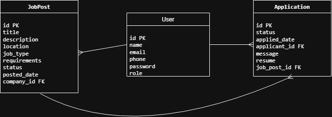
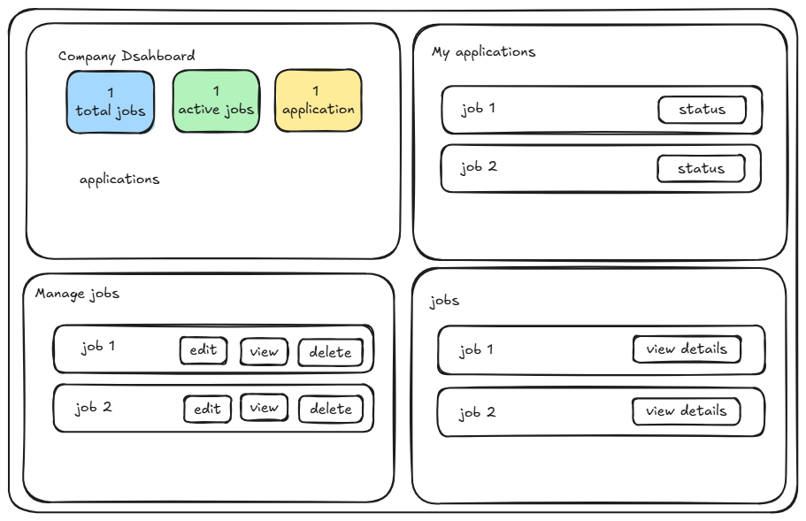
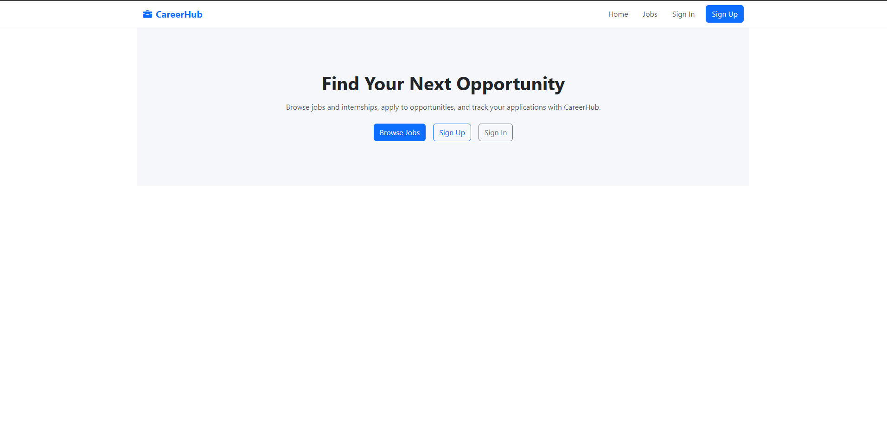

# CareerHub

## Description

CareerHub is a job and internship platform where companies can post opportunities and applicants can apply and track their application status.

## User Stories

- As a user, I want to sign up as either an applicant or a company so that I can access the correct features.
- As a user, I want to sign in so that I can access my account.
- As a user, I want to sign out so that I can securely leave my account.
- As an applicant, I want to browse available job and internship positions so that I can find opportunities.
- As an applicant, I want to view the details of a position before applying.
- As an applicant, I want to apply to a job or internship position.
- As an applicant, I want to view all of my submitted applications.
- As an applicant, I want to view the status of each application so that I can track my progress.
- As an applicant, I want to see whether my application is Applied, Reviewed, Interview, or Got the Job.
- As an applicant, I should not be able to create, edit, or delete job and internship positions.
- As a company, I want to create job and internship positions so that applicants can apply.
- As a company, I want to view all of the positions I have posted.
- As a company, I want to view the details of one of my positions.
- As a company, I want to edit my own job or internship positions.
- As a company, I want to delete my own job or internship positions.
- As a company, I want to view the applicants who have applied to my positions.
- As a company, I want to update an application's status to Reviewed, Interview, or Got the Job.
- As a company, I should only be able to edit or delete positions that I created.
- As a company, I should not be able to apply to job or internship positions.
- As a user, I should only be able to access actions that are allowed for my account type.
- As a user, I should only be able to update or delete data that I am authorized to manage.
- As a guest user, I should not be able to create, update, or delete protected data.

### Deployed Application

Coming soon.

### Planning Materials

### Back-End Repository

https://github.com/hessa7a/careerhub-backend

## Technologies Used

- React
- JavaScript
- Vite
- Bootstrap
- Bootstrap Icons
- React Router
- FastAPI
- Python
- PostgreSQL
- SQLAlchemy
- Alembic
- JWT Authentication
- Git
- GitHub

## Next Steps

- Allow applicants to upload CV files directly instead of providing a CV link.
- Add applicant and company profile pages
- Improve mobile responsiveness

## Attributions

- Bootstrap
- Bootstrap Icons